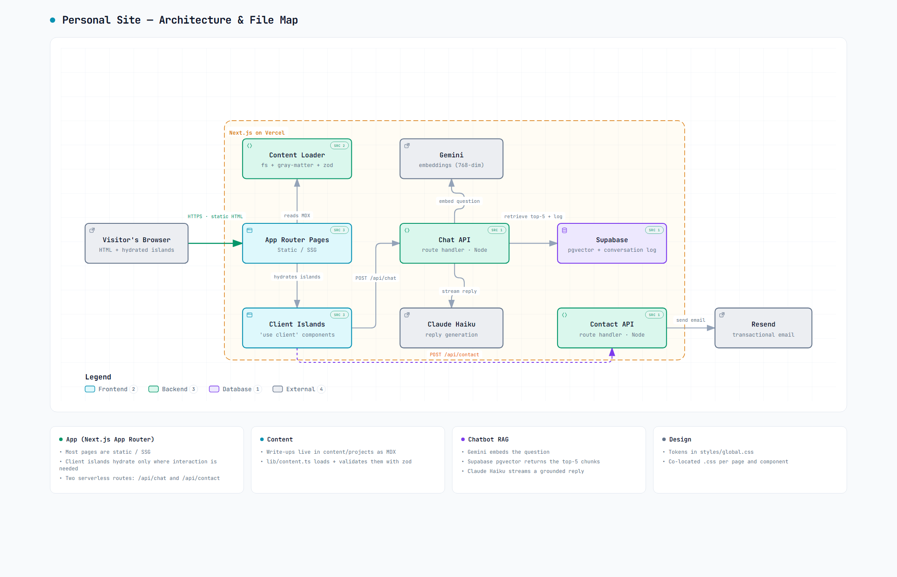
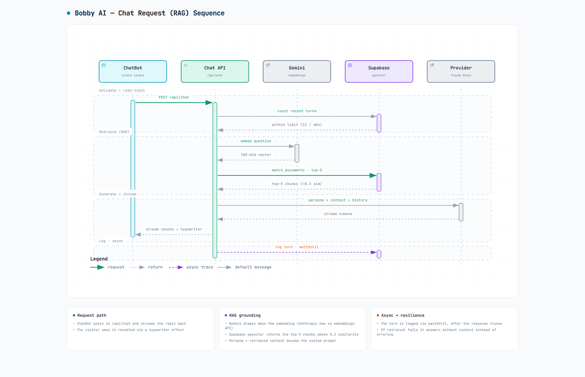

# Bobby Muljono's personal site

Welcome. This is the source code behind my personal site: a small home for my story, a few pieces of work I'm proud of, and "Bobby AI", a chatbot that answers questions as me.

It's live at **[www.bobbymuljono.com](https://www.bobbymuljono.com)**.

I'm a Senior Data Analyst who now spends most of my time building with AI, and the site reflects that. It's meant to be fast and quiet, hand-built rather than assembled from heavy libraries, with one genuinely interactive piece: an AI version of me you can actually chat with.

## What's inside

- A short bio and an experience timeline
- Write-ups of selected projects, with hand-drawn architecture diagrams and looping, hand-coded demos of the product in action (no video, no GIFs, just CSS)
- **Bobby AI**, a chatbot grounded in real facts about my work (how it works is below)
- A light and dark theme, plus a contact form
- Almost no JavaScript shipped to your browser, so pages stay quick

## How it all fits together

The site runs on Next.js and lives on Vercel. Most pages are plain static HTML. Only the parts that truly need to react to you (the chatbot, the contact form, the theme toggle) ship any JavaScript at all.

The diagram below doubles as a map of the code: every box names the real files behind it, so it's a good place to start if you're poking around.



_Prefer to click around? Open [`docs/diagrams/site-architecture.html`](./docs/diagrams/site-architecture.html) in a browser for the interactive version (trace connections, switch light and dark)._

Reading it left to right: your browser loads a static page. When a project write-up needs its words, a small content loader reads them from Markdown. The two interactive pieces each talk to a tiny serverless function, one for the chatbot and one for the contact form. Everything inside the dashed box runs on Vercel; the boxes outside it are the outside services I lean on.

## How Bobby AI works

Bobby AI looks things up before it answers, so it stays grounded in real facts about me instead of making things up. Here's a single question, from the moment you hit send to the reply streaming back:



_Interactive version: [`docs/diagrams/chat-rag.html`](./docs/diagrams/chat-rag.html)._

In plain terms: when you send a message, it first pulls the most relevant snippets about me (my bio, FAQs, project write-ups), hands those to a language model as background, and streams the answer back word by word. If it can't find anything relevant it answers carefully rather than guessing, and it keeps private details private.

## The stack, briefly

- **[Next.js](https://nextjs.org) 15** (App Router) and **React 19**, in TypeScript
- **Vercel** for hosting
- **Supabase** (Postgres with pgvector) as the chatbot's memory and search
- **Gemini** for the lookups, **Claude** (or Gemini) for the replies
- **Resend** for the contact form
- Hand-written CSS with design tokens and self-hosted fonts, no UI or animation library

The thinking behind the design (colors, type, layout, and the sites that inspired it) lives in [DESIGN_NOTES.md](./DESIGN_NOTES.md).

## Running it locally

You'll need Node 22.12 or newer, and a `.env` file (copy `.env.example` and fill in the keys the chatbot and contact form use).

```bash
npm install
npm run dev
```

That serves the site at `localhost:3000`. A few other commands:

| Command | What it does |
| --- | --- |
| `npm run build` | Build the production site |
| `npm run start` | Serve that build locally |
| `npm run lint` | Check the code |
| `npm run ingest` | Rebuild the chatbot's knowledge base after editing it |

## License

The code is under [LICENSE](./LICENSE). The writing and images are all rights reserved unless noted otherwise.
